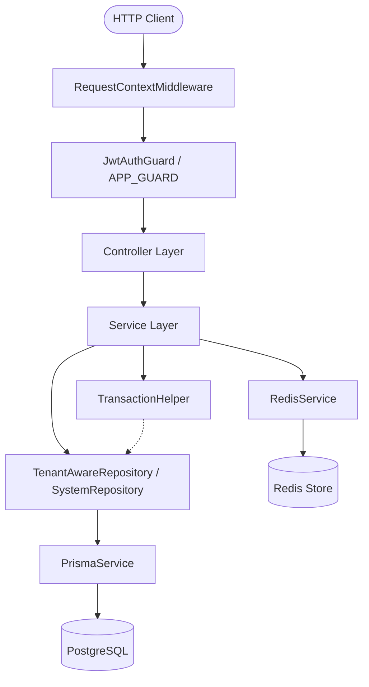
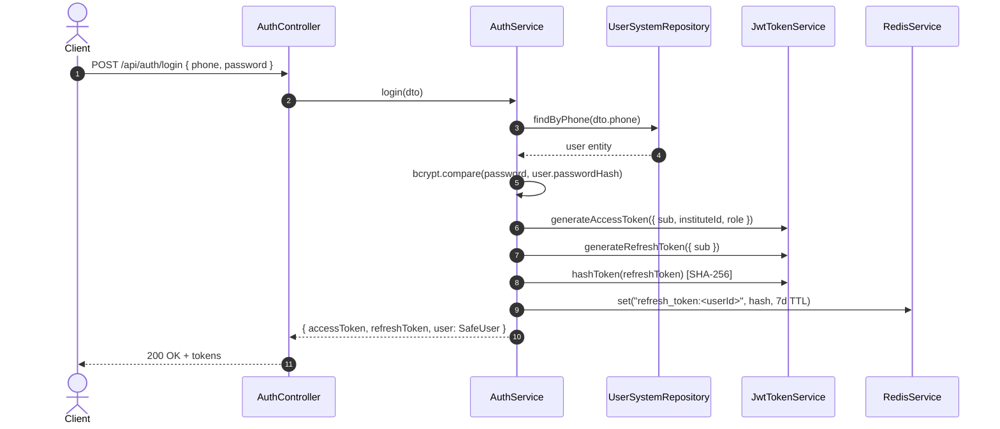

# Backend Architectural Rules, Coding Conventions, and System Constraints (`role.md`)

> **Document Status**: Authoritative Engineering Contract  
> **Target Audience**: AI Agents, Backend Developers, and System Architects  
> **Project**: SaaS Education Platform Backend (`institute-platform-backend`)  
> **Stack**: NestJS 12, TypeScript 6, Prisma ORM 7 (`@prisma/adapter-pg`), PostgreSQL, Redis (`ioredis`), JWT  

---

## 1. Architectural Overview and Layer Responsibilities

The backend follows a strict unidirectional, layered architectural flow:

```text
HTTP Request
    ↓
RequestContextMiddleware (AsyncLocalStorage initialization)
    ↓
JwtAuthGuard (Authentication & Context Enrichment)
    ↓
Controller (HTTP Binding, Validation, & Response Mapping)
    ↓
Service (Domain Business Logic & Orchestration)
    ↓
Repository (Data Access, Isolation, & Query Encapsulation)
    ↓
Prisma ORM (@prisma/adapter-pg)
    ↓
PostgreSQL Database
```

Each layer has strictly defined boundaries and invariants.



### 1.1 Controllers (`src/modules/<feature>/<feature>.controller.ts`)

Controllers are the HTTP boundary adapters.

#### Controllers MUST:
* Remain thin and focused exclusively on HTTP concerns (routing, status codes, headers, parameter extraction).
* Validate and parse incoming payloads via NestJS DTOs.
* Extract authenticated caller information exclusively using `@CurrentUser()` and `@CurrentInstituteId()` decorators.
* Mark unauthenticated endpoints explicitly with the `@Public()` decorator.
* Delegate all business actions to domain services and return service results.
* Use explicit HTTP status code decorators (e.g., `@HttpCode(HttpStatus.OK)`) for non-201 `POST` endpoints.

#### Controllers MUST NOT:
* Access `PrismaService` or execute database queries directly.
* Contain business logic, calculation, or domain validation rules.
* Implement manual tenant filtering or cross-tenant validation.
* Read or write directly to `AsyncLocalStorage` (`RequestContext`).
* Instantiate services or repositories using `new`.

---

### 1.2 Services (`src/modules/<feature>/<feature>.service.ts`)

Services are the sole orchestrators of business logic and domain invariants.

#### Services MUST:
* Contain all domain validation, state transitions, calculations, and business workflows.
* Perform assertions and validation using `Ensure` and `ErrorMessages`.
* Coordinate between domain repositories and external infrastructure (e.g., `RedisService`, `JwtTokenService`).
* Execute multi-step atomic operations using `TransactionHelper.executeInTransaction()`.
* Sanitize and map internal entities to safe output structures (e.g., stripping `passwordHash`).
* Reuse existing domain services rather than duplicating queries or business logic.

#### Services MUST NOT:
* Depend on Express `Request` or `Response` objects.
* Execute direct Prisma queries when a repository method exists or should exist.
* Duplicate business validation logic that is already implemented in another domain service.
* Throw raw `new Error(...)` for predictable domain/validation errors (use `Ensure` or NestJS HTTP exceptions).

---

### 1.3 Repositories (`src/modules/<feature>/<feature>.repository.ts`)

Repositories own all data persistence and retrieval logic.

#### Repositories MUST:
* Extend `TenantAwareRepository<T>` for all tenant-scoped database models (`instituteId`).
* Extend `SystemRepository<T>` ONLY WHEN explicit cross-tenant access is required by system architecture (e.g., authentication lookup, super-admin maintenance).
* Encapsulate complex Prisma query filters, nested includes, and aggregations.
* Automatically leverage `this.client` to support seamless inclusion inside interactive Prisma transactions.
* Expose intention-revealing, domain-specific query methods (e.g., `findByPhone`, `findByIdWithInstitute`).

#### Repositories MUST NOT:
* Contain business rule validation (business validation belongs in Services).
* Depend on Controllers, HTTP Request/Response objects, or presentation DTOs.
* Accept manual `instituteId` arguments when extending `TenantAwareRepository` (it is resolved from context).
* Bypass tenant isolation filters.

---

## 2. Request Context (`AsyncLocalStorage`)

Request context isolation is implemented in `src/context/request-context.ts` using Node.js `AsyncLocalStorage`.

```text
Incoming Request
       ↓
RequestContextMiddleware (sets userId: 0, instituteId: 0, role: '', language: Accept-Language)
       ↓
JwtAuthGuard (extracts token payload → enriches userId, instituteId, role in RequestContext)
       ↓
Application Layers (Repositories & Services read RequestContext synchronously & concurrency-safely)
```

### Context Schema (`RequestContextData`)
```ts
export interface RequestContextData {
  userId: number;
  instituteId: number;
  role: string;
  language: string;
}
```

### Rules & Constraints:
1. **Concurrency Safety**: Each asynchronous execution chain has an isolated store. Request data MUST NOT be stored in global variables, static class fields, or singleton service properties.
2. **Lifecycle Flow**:
   - `RequestContextMiddleware` wraps the entire downstream execution inside `RequestContext.run(...)` with default values and extracts the `Accept-Language` header (defaulting to `'en'`).
   - `JwtAuthGuard` mutates the active store in place upon validating the JWT access token, setting `userId`, `instituteId`, and `role`.
3. **Consumption Rules**:
   - Repositories MUST call `RequestContext.getInstituteId()` to retrieve the tenant ID.
   - Centralized error formatting MUST call `RequestContext.getLanguage()` to resolve translation strings.
   - Controllers and services MUST NOT pass Express `req` through internal method signatures merely to deliver user or tenant metadata.
4. **Failure Behavior**: Calling `RequestContext.getInstituteId()` outside an authenticated request context throws an explicit error: `"Institute context is not available. This request may not be authenticated."`

---

## 3. Multi-Tenancy Architecture

The platform operates as a relational multi-tenant SaaS where **`Institute` is the authoritative tenant boundary**.

```text
                        ┌───────────────────────────────┐
                        │       Institute (Tenant)      │
                        └───────────────┬───────────────┘
               ┌────────────────────────┼────────────────────────┐
               ▼                        ▼                        ▼
        ┌─────────────┐          ┌─────────────┐          ┌─────────────┐
        │   Branch    │          │    User     │          │AcademicYear │
        └──────┬──────┘          └─────────────┘          └──────┬──────┘
               │                                                 │
               └────────────────────────┬────────────────────────┘
                                        ▼
                                 ┌─────────────┐
                                 │   Section   │
                                 └─────────────┘
```

### Core Multi-Tenancy Invariants:
1. **Never Trust Client Tenant Input**: The client request body, query parameters, or route headers MUST NEVER be trusted to determine the authoritative `instituteId`. The `instituteId` MUST always be derived from the verified JWT access token in `RequestContext`.
2. **Subdivisions are Not Tenants**: `Branch` records are subdivisions of an `Institute`, not independent tenants. All branch-level entities belong to the root `Institute`.
3. **Single Tenant Membership**: Every user belongs to exactly one `Institute`.
4. **Relational Scope**: All major database entities maintain a direct or compound foreign key to `Institute` (`instituteId`) and unique compound keys (`@@unique([instituteId, id])`).
5. **No Cross-Tenant Leakage**: Unintended cross-institute data exposure is a critical security violation.

---

## 4. Repository Tenant Enforcement

Tenant isolation is an architectural invariant enforced at the base repository layer, eliminating manual developer query filtering.

### 4.1 Hierarchy: `BaseRepository` vs `TenantAwareRepository` vs `SystemRepository`

```text
             ┌────────────────────────────────────┐
             │       BaseRepository<T>            │
             │   - CRUD via Prisma Delegate       │
             │   - TransactionContext awareness   │
             │   - findManyPaginated              │
             └─────────────────┬──────────────────┘
                               │
            ┌──────────────────┴──────────────────┐
            ▼                                     ▼
┌───────────────────────────────┐   ┌───────────────────────────────┐
│   TenantAwareRepository<T>    │   │     SystemRepository<T>       │
│  - Injects instituteId        │   │  - NO tenant scoping          │
│  - Scopes findById/findMany   │   │  - Auth & system maintenance  │
│  - Protects update/delete     │   │  - Explicit & auditable       │
└───────────────────────────────┘   └───────────────────────────────┘
```

### 4.2 Implementation Rules:
* **`TenantAwareRepository<T>`**:
  - `getInstituteId()`: Fetches the tenant ID via `RequestContext.getInstituteId()`.
  - `scopeWhere(where)`: Injects `{ ...where, instituteId: this.getInstituteId() }`.
  - `findById(id)`: Uses `findFirst({ where: { id, instituteId: this.getInstituteId() } })`.
  - `create(data)`: Automatically sets `data.instituteId = this.getInstituteId()`.
  - `update(id, data)` / `delete(id)`: Verifies tenant ownership via `findById(id)` before modifying the record. Throws `NotFoundException` if the record does not belong to the current institute.
  - `findMany`, `count`, `exists`, and `findManyPaginated`: Automatically scoped with `scopeWhere()`.
* **`SystemRepository<T>`**:
  - Used ONLY for legitimate cross-tenant requirements:
    1. User login (locating user by unique phone across the entire system prior to authentication).
    2. Token refresh and account validity verification.
    3. Super-admin platform operations.
  - MUST NOT be used in feature domain modules where `TenantAwareRepository` applies.

---

## 5. Prisma ORM Conventions

The project uses Prisma 7 with the `@prisma/adapter-pg` driver adapter.

### Prisma Rules:
1. **Access via Repositories Only**: `PrismaService` MUST NOT be injected into Controllers. It SHOULD be accessed exclusively via Repositories and `TransactionHelper`.
2. **Preserve Generated Types**: Use Prisma's generated types (e.g., `User`, `Institute`, `Prisma.UserWhereInput`) for entity references and query structures. Do not substitute them with `any` or loose custom interfaces.
3. **Lifecycle Management**: `PrismaService` extends `PrismaClient` and implements `OnModuleInit` (`$connect()`) and `OnModuleDestroy` (`$disconnect()`).
4. **Connection Pool**: Database connection configuration is supplied via `DATABASE_URL` through `ConfigService` in `PrismaService`.
5. **Schema as Single Source of Truth**: The Prisma schema (`prisma/schema.prisma`) defines the authoritative data model, foreign keys, cascade rules, and indexes.

---

## 6. Centralized Error Handling

Error handling is standardized around the `Ensure` validation utility, the `ErrorMessages` registry, and the `GlobalExceptionFilter`.

```text
Service Layer (Ensure.exists / Ensure.required / Ensure.unauthorized)
       ↓ Throws NestJS HttpException (NotFoundException, BadRequestException, etc.)
GlobalExceptionFilter (Catches exception)
       ↓ Formats normalized JSON response
Client Response
```

### 6.1 `Ensure` Guard Methods (`src/common/errors/ensure.ts`)

| Method | Behavior | HTTP Status |
| :--- | :--- | :--- |
| `Ensure.exists(val, resource)` | Asserts `val` is not null/undefined; throws with `{resource} not found` | `404 Not Found` |
| `Ensure.required(val, field)` | Asserts `val` is not null/undefined/empty string; throws with `{field} is required` | `400 Bad Request` |
| `Ensure.alreadyExists(val, resource)` | Asserts `val` is null/undefined; throws if resource exists | `409 Conflict` |
| `Ensure.unauthorized(cond, msg?)` | Throws if `cond === true` | `401 Unauthorized` |
| `Ensure.forbidden(cond, msg?)` | Throws if `cond === true` | `403 Forbidden` |
| `Ensure.isNumber(val, field)` | Asserts `typeof val === 'number'` and not `NaN` | `400 Bad Request` |
| `Ensure.isArray(val, field)` | Asserts `Array.isArray(val)` | `400 Bad Request` |
| `Ensure.custom(cond, msg, status)` | Throws `HttpException(msg, status)` if `cond === true` | Configurable (`400` default) |

### 6.2 Standard Error Response Payload
All errors returned by the API conform to `ErrorResponse`:
```json
{
  "statusCode": 404,
  "message": "User not found",
  "error": "NotFoundException",
  "timestamp": "2026-09-01T13:15:30.000Z",
  "path": "/api/users/99"
}
```

### Rules:
* Developers MUST NOT use `throw new Error(...)` for predictable application or domain errors.
* Unhandled non-HTTP exceptions are caught by `GlobalExceptionFilter`, logged with full stack traces, and returned as generic `500 Internal server error` responses.

---

## 7. Localization and Internationalization (i18n)

The application supports multi-language error messaging through `ErrorMessages` (`src/common/errors/error-messages.ts`).

### Language Resolution:
1. `RequestContextMiddleware` parses the HTTP `Accept-Language` header from incoming requests.
2. The language code (e.g., `'ar'`, `'en'`) is stored in `RequestContext`.
3. `ErrorMessages.get(key, params)` fetches the message in the resolved language, falling back to `'en'`.

### Rules:
* Error strings MUST NOT be hardcoded inside service logic.
* To add a new error message, register the key across all language dictionaries in `error-messages.ts`.
* Parameter placeholders use `{paramName}` syntax (e.g., `"{resource} not found"` / `"{resource} غير موجود"`).

---

## 8. Authentication and Session Management

Authentication is built with dual JWT tokens (Access + Refresh) and Redis state management.



### 8.1 Token Specifications
* **Access Token**:
  - Purpose: Stateless authentication for every request.
  - Secret: `JWT_ACCESS_SECRET` (distinct from refresh secret).
  - Expiry: Short-lived (default `15m`).
  - Payload: `{ sub: number, instituteId: number, role: string }`.
* **Refresh Token**:
  - Purpose: Obtaining new token pairs without re-submitting credentials.
  - Secret: `JWT_REFRESH_SECRET` (distinct from access secret).
  - Expiry: Long-lived (default `7d`).
  - Payload: `{ sub: number }`.

### 8.2 Security & Revocation Invariants:
1. **Password Hashing**: Passwords MUST be hashed using `bcryptjs` with salt rounds = 12.
2. **Password Secrecy**: `passwordHash` MUST NEVER be returned in any DTO, response object, or log statement.
3. **Refresh Token Storage**: Refresh tokens are stored in Redis as SHA-256 hashes (`refresh_token:<userId>`) with a 7-day TTL. Raw tokens are never stored in plaintext.
4. **Token Rotation**: Refreshing tokens issues a new access token AND a new refresh token, updating the Redis hash immediately.
5. **Logout**: Calling `/api/auth/logout` deletes the `refresh_token:<userId>` entry from Redis, invalidating future refresh attempts.
6. **Stateless Access Verification**: The global `JwtAuthGuard` verifies the access token signature statelessly without database hits. User existence is re-verified during refresh.

### 8.3 Role-Based Access Control (RBAC)
Role authorization is enforced at the controller and route level using the `@Roles(...)` decorator and `RolesGuard`:
* **Roles Enum (`UserRole`)**: `SUPER_ADMIN`, `INSTITUTE_ADMIN`, `TEACHER`, `FAMILY`, `STUDENT`.
* **Decorator (`@Roles`)**: Attached to a Controller class or route handler method (`@Roles(UserRole.SUPER_ADMIN)`).
* **`RolesGuard`**: Applied globally via `APP_GUARD` in `AuthModule` immediately after `JwtAuthGuard`. Checks whether the caller's role (`request.user.role` or `RequestContext.getRole()`) is included in the endpoint's required roles. If unauthorized, throws `ForbiddenException` (403) via `Ensure.forbidden`.
* **Public Exemption**: Routes decorated with `@Public()` automatically bypass both `JwtAuthGuard` and `RolesGuard`.

---

## 9. DTOs and API Validation

Validation is enforced at the HTTP boundary via NestJS `ValidationPipe`.

### Global Configuration (`src/main.ts`):
```ts
app.useGlobalPipes(
  new ValidationPipe({
    whitelist: true,            // Strips any property not defined in DTO
    forbidNonWhitelisted: true,  // Throws 400 if extra properties are sent
    transform: true,            // Automatically coerces payloads to DTO class instances
    transformOptions: {
      enableImplicitConversion: false,
    },
  }),
);
```

### DTO Rules:
* All controller inputs (`@Body()`, `@Query()`, `@Param()`) MUST have strongly typed DTO classes decorated with `class-validator` and `class-transformer` decorators.
* DTOs MUST ONLY validate syntax, format, data types, and presence.
* Domain business rules (e.g., verifying user balance, relationship validity) MUST NOT be embedded in DTO custom validators; they belong in Services.

---

## 10. Service Reuse and Domain Ownership

To prevent logic duplication and divergent business rules:

1. **Single Domain Authority**: Every domain model has an authoritative owner service (e.g., `UsersService` owns user lifecycle operations).
2. **Cross-Domain Reusability**: When feature A requires logic from feature B, feature A's service MUST inject and call feature B's service rather than duplicating queries or business rules.
3. **No Controller-to-Controller Calls**: Controllers MUST NOT call other controllers.
4. **No Repository Bypassing**: Do not duplicate a repository query in an unrelated service; expose a method on the owning repository or service.

---

## 11. Pagination Standards

All paginated endpoints MUST conform to standard query and response structures.

### 11.1 Query Parameters (`PaginationQueryDto`)
* `page`: 1-based page index (`@IsPositive()`, `@IsInt()`, default = `1`).
* `limit`: Items per page (`@IsPositive()`, `@IsInt()`, `@Max(100)`, default = `20`).
* `skip`: Computed property `(page - 1) * limit` for Prisma offset.

### 11.2 Response Shape (`PaginatedResult<T>`)
```ts
export interface PaginatedResult<T> {
  data: T[];
  total: number;
  page: number;
  limit: number;
  totalPages: number;
}
```

### 11.3 Implementation:
Repositories extending `BaseRepository` provide `findManyPaginated(pagination, options)` which executes data fetching and total count concurrently via `Promise.all([findMany, count])` and returns `createPaginatedResult(data, total, page, limit)`.

---

## 12. Filtering and Searching

Dynamic query filtering MUST use Prisma-compatible structures and avoid SQL injection or untyped query builders.

### 12.1 `FilterBuilder` Utility (`src/common/filters/filter-builder.ts`)
The `FilterBuilder<TWhere>` provides a fluent API for building typed Prisma `where` objects:
```ts
const where = new FilterBuilder<Prisma.UserWhereInput>()
  .contains('fullName', query.search)
  .equals('role', query.role)
  .boolean('isActive', query.isActive)
  .range('createdAt', query.fromDate, query.toDate)
  .build();
```

### Rules:
* Methods in `FilterBuilder` (`equals`, `contains`, `in`, `notIn`, `range`, `startsWith`, `endsWith`, `boolean`, `relation`, `custom`) are safe no-ops when the passed value is `undefined` or `null`.
* `contains` defaults to case-insensitive matching (`mode: 'insensitive'`).
* For complex nested queries or raw Prisma expressions, define typed Prisma where objects directly. Do NOT build ad-hoc string-based query builders.

---

## 13. Transactions and Atomicity

Multi-step database modifications that require ACID guarantees MUST use Prisma interactive transactions.

### 13.1 `TransactionHelper` & `TransactionContext` (`src/database/`)

The application integrates Prisma interactive transactions with `AsyncLocalStorage`:

```ts
await this.transactionHelper.executeInTransaction(async () => {
  // All repository operations invoked inside this scope automatically
  // execute against the active Prisma transaction client.
  const user = await this.userRepository.create({ ... });
  await this.profileRepository.create({ userId: user.id, ... });
});
```

### Rules:
* Repositories MUST access Prisma via `this.client`, which resolves `TransactionContext.get() ?? this.prisma`.
* Developers MUST NOT pass transaction client objects (`tx`) manually through service and repository method signatures.
* Never simulate transactions manually. If an unhandled error occurs within `executeInTransaction`, the entire transaction is rolled back automatically by Prisma.

---

## 14. Module Structure and Directory Conventions

Modules are organized by functional domain under `src/modules/`:

```text
src/
├── common/                     # Cross-cutting utilities & infrastructure
│   ├── decorators/             # Parameter & method decorators (@CurrentUser, @Roles, @Public)
│   ├── errors/                 # Ensure, ErrorMessages, GlobalExceptionFilter
│   ├── filters/                # FilterBuilder
│   ├── pagination/             # PaginationQueryDto, PaginatedResult
│   └── types/                  # AuthenticatedUser, UserRole enum, common interfaces
├── context/                    # RequestContext (AsyncLocalStorage) & middleware
├── database/                   # PrismaService, RedisService, Base/Tenant/System Repositories, Transactions
└── modules/                    # Feature domain modules
    ├── auth/                   # Authentication module
    │   ├── dto/                # LoginDto, RefreshTokenDto, AuthResponse DTOs
    │   ├── guards/             # JwtAuthGuard, RolesGuard
    │   ├── auth.controller.ts
    │   ├── auth.service.ts
    │   ├── jwt-token.service.ts
    │   └── auth.module.ts
    ├── institutes/             # Super Admin Institute management module
    │   ├── dto/                # CreateInstituteDto, InstituteResponse DTOs
    │   ├── institute.repository.ts
    │   ├── institutes.controller.ts
    │   ├── institutes.service.ts
    │   └── institutes.module.ts
    └── users/                  # User management module
        ├── user.repository.ts          # Tenant-scoped repository
        ├── user-system.repository.ts   # System-level repository (cross-tenant)
        └── users.module.ts
```

### Future Module Creation Rules:
When creating a new domain feature (e.g., `students`, `sections`, `finances`):
1. Place the module in `src/modules/<feature_name>/`.
2. Include `<feature>.controller.ts`, `<feature>.service.ts`, `<feature>.repository.ts`, `<feature>.module.ts`, and a `dto/` directory.
3. Import `PrismaModule` (or register required repositories) and register the module in `src/app.module.ts`.

---

## 15. Dependency Injection and IoC

1. **NestJS DI Exclusively**: All services, repositories, helpers, and guards MUST be decorated with `@Injectable()` and managed by NestJS IoC container.
2. **No Manual Instantiation**: Never use `new ServiceClass()` or `new RepositoryClass()` inside application code.
3. **Module Exports**: If a service or repository is required by another module, it MUST be exported in its declaring module and the declaring module imported into the consumer module.
4. **Avoid Circular Dependencies**: Design service hierarchies to prevent circular dependencies. Use `forwardRef()` only as an exceptional last resort.

---

## 16. Configuration and Secrets Management

1. **Environment Variables**: All environment-dependent values MUST be retrieved using `@nestjs/config` (`ConfigService`) or typed config abstractions.
2. **Never Hardcode Secrets**:
   - Database credentials (`DATABASE_URL`)
   - JWT secrets (`JWT_ACCESS_SECRET`, `JWT_REFRESH_SECRET`)
   - Redis host/passwords (`REDIS_HOST`, `REDIS_PASSWORD`)
   - API keys and tokens
3. **Strict Validation**: Critical configurations MUST use `configService.getOrThrow<string>('KEY')` on startup to fail fast if variables are missing.

---

## 17. Relational Database Rules

The Prisma schema (`prisma/schema.prisma`) represents the educational institute domain model.

### Key Relational Constraints:
* **Tenant Root**: `Institute` is the root.
* **Branches**: `Branch` belongs to `Institute` (`@@unique([instituteId, code])`, `@@unique([instituteId, id])`).
* **Academic Hierarchy**: `AcademicYear` -> `Section` -> `StudentEnrollment` / `Timetable` / `StudentSubscription`.
* **Pedagogical Links**: `Subject`, `Teacher`, `SectionTeacher`, `SectionSubject`, `Lesson`, `Exam`, `ExamResult`, `LessonAttendance`.
* **Financial Model**: `StudentSubscription` -> `Installment` -> `Payment`.
* **Compound Keys**: Tenant-aware tables MUST maintain compound uniqueness where applicable (e.g., `@@unique([instituteId, id])`) to reinforce multi-tenant data integrity.

---

## 18. TypeScript and Code Quality Standards

* **Strict TypeScript**: Strict mode is enabled (`strict: true`, `noImplicitAny: true`).
* **No `any`**: Avoid `any`. Use generics, `unknown` with type guards, or explicit Prisma generated types.
* **Explicit Return Types**: Public service and repository methods SHOULD have explicit return types.
* **Linting & Formatting**: Code MUST pass `npm run lint` (`oxlint`) and `npm run format` (`prettier`).
* **No Compiler Suppression**: Do not use `@ts-ignore` or `@ts-nocheck` to bypass compilation or type-checking errors.

---

## 19. Mandatory AI Agent Rules

Any AI coding assistant or automated agent working on this backend MUST obey the following instructions:

1. **Read `role.md` First**: Always read and adhere to `role.md` before designing or implementing any code changes.
2. **Preserve Tenant Isolation**: NEVER bypass `TenantAwareRepository` or omit `instituteId` scoping for tenant-owned models.
3. **No Direct Prisma in Controllers**: Controllers MUST NOT inject or execute `PrismaService`.
4. **No Competing Patterns**: NEVER introduce a secondary pattern (e.g., TypeORM, Passport strategies, manual SQL queries, ad-hoc exceptions) when a project pattern already exists (`FilterBuilder`, `Ensure`, `JwtTokenService`, `RequestContext`).
5. **Single Domain Ownership**: NEVER duplicate business logic across modules.
6. **No Silent Refactoring**: DO NOT refactor existing working modules or change established API contracts unless specifically instructed in the task.
7. **Maintain Error Standards**: Use `Ensure` and `ErrorMessages` for domain validations and HTTP errors.
8. **Keep DTOs and Contracts Strict**: All new endpoints MUST have validated DTOs with `class-validator`.
9. **Preserve Prisma Type Safety**: Do not cast database entities to `any`.
10. **Consistency Over Preference**: Always prioritize consistency with the established codebase over external conventions or personal style.

---

## 20. Change Safety Invariant

> **Primary Engineering Mandate**:  
> A modification in one feature MUST NOT unexpectedly alter or break the behavior of unrelated features.

### Guidelines for Change Safety:
* Before modifying shared infrastructure (`src/common/`, `src/context/`, `src/database/`), inspect all consumer modules.
* Run existing automated unit and e2e test suites (`npm run test`, `npm run test:e2e`) to verify that modifications do not regress system functionality.
* Avoid global mutable state or side effects outside the request's `AsyncLocalStorage` scope.

---

## 21. Documentation and Contract Maintenance

* `role.md` is the single persistent architectural contract for the backend.
* When a new permanent architectural pattern, infrastructure service, or global convention is introduced and approved, `role.md` MUST be updated in the same pull request.
* Architectural rules MUST NOT remain isolated in ephemeral discussions or conversation histories.
